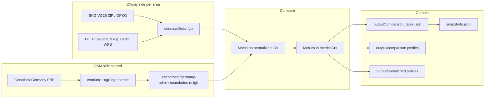

# Processing and analysis (how the pipeline works)

This document describes how the **OSM boundary checker (Germany)** ingests official and OSM boundaries, matches them, computes metrics, and what the published artifacts and UI numbers mean. Implementation entry points: [`scripts/compare/compare-boundaries.ts`](../scripts/compare/compare-boundaries.ts), [`scripts/compare/lib/compare.ts`](../scripts/compare/lib/compare.ts), [`scripts/compare/lib/metrics/calculateMetrics.ts`](../scripts/compare/lib/metrics/calculateMetrics.ts) (per-metric modules under [`scripts/compare/lib/metrics/`](../scripts/compare/lib/metrics/)).

---

## Runtime folder contract

- **`scripts/`**: pipeline and compare implementation.
- **`datasets/`**: area configs, official source files, and generated compare outputs.
- **`data/`**: pipeline processing status/log artifacts consumed by report status views.
- **`report/`**: frontend app and static snapshot/build tooling.
- **`.cache/`**: downloaded source and extraction caches.

`DATA_ROOT` is the runtime root that should contain `datasets/` and `data/`. Report snapshot/index generation and processing status are expected to read from the same `DATA_ROOT`.

---

## End-to-end flow

Nightlies and one-shot runs are orchestrated from the workspace root (see [README.md](../README.md)): `download` (BKG + optional HTTP official + OSM PBF/extract) then `compare` per `datasets/<area>/config.jsonc`. The scheduled **`pipeline:nightly`** refreshes BKG and **all** `download.official` areas on **Fridays** only (same cadence as BKG); other days reuse cached `source/official.fgb`.

---

## How we compare the data

1. **Inputs**
   - **Official:** one FlatGeobuf per area at `datasets/<area>/<official.path>` (typically `source/official.fgb`).
   - **OSM:** a **single shared** FlatGeobuf for all areas: `.cache/osm/germany-admin-boundaries-rs.fgb`, built from the Germany extract. Every administrative feature carries a non-empty `de:regionalschluessel` where applicable (plus a synthetic key for the national border compare).

2. **Matching key**
   - OSM side always uses the tag **`de:regionalschluessel`** (see `OSM_MATCH_PROPERTY` in [`scripts/compare/lib/config.ts`](../scripts/compare/lib/config.ts)).
   - Official side uses the property named in **`official.matchProperty`** in that area’s `config.jsonc` (e.g. BKG ARS column, Berlin Bezirke `name`, Berlin Ortsteile `sch`).
   - Optional **`official.keyTransposition`**: when the official dataset has no compatible Schlüssel, map values from **`official.matchProperty`** to raw OSM Schlüssel strings, then normalize ([`scripts/compare/lib/officialKeyTransposition.ts`](../scripts/compare/lib/officialKeyTransposition.ts)).
   - Values are normalized with a **preset** (`berlin-bezirk-ags`, `amtlicher-8`, `regional-12`) in [`scripts/compare/lib/normalizeGermanKey.ts`](../scripts/compare/lib/normalizeGermanKey.ts) so shortened official keys and 12-digit OSM keys align where intended.

2b. **Optional bbox prefilter**  
 If **`compare.applyBboxFilter`** is true, compare derives a union bbox from official geometries, expands it by **`compare.bboxBufferDegrees`** (default `0.05`° when omitted), and drops OSM features whose bbox does not overlap before merge/metrics ([`scripts/compare/lib/compare.ts`](../scripts/compare/lib/compare.ts)).

3. **Geometry merge**  
   Multiple official or OSM features sharing the same normalized key are **unioned** before metrics ([`scripts/compare/lib/geoMerge.ts`](../scripts/compare/lib/geoMerge.ts)).

4. **Row set**
   - One **main table row per official key** (after union): `matched` if OSM has the same key, else `official_only`.
   - **Unmatched OSM:** keys present in OSM but not in that area’s official export → `unmatchedOsm` in `comparison_table.json` and optional `unmatched.pmtiles`.

5. **Metrics CRS**  
   Geometries are reprojected to each area’s **`metricsCrs`** (e.g. `EPSG:25832` for most BKG areas, `EPSG:32633` for Berlin Bezirke) before intersection, union, areas, and Hausdorff ([`scripts/compare/lib/projectGeometry.ts`](../scripts/compare/lib/projectGeometry.ts)).

---

## BKG data (national administrative layers)

- **Product:** BKG **VG25** (Verwaltungsgebiete 1:25 000), distributed as a GeoPackage inside a ZIP.
- **Commands:** `bun run bkg:download`, `bun run bkg:extract` (or combined `bun run bkg`).
- **Details:** URLs, layer names (`vg25_gem`, `vg25_krs`, …), and `matchProperty` / preset hints: [vg25-bkg.md](./vg25-bkg.md).
- **Per-area configs:** under `datasets/de-*/config.jsonc` — each points `official.path` at the extracted `source/official.fgb` and sets `matchProperty` + `idNormalization.preset` + `metricsCrs`.

---

## Berlin data (Bezirke example)

- **Official:** Berlin ALKIS Bezirke via WFS GeoJSON, fetched by `download:official` into `datasets/berlin-bezirke/source/official.fgb` (see [`datasets/berlin-bezirke/config.jsonc`](../datasets/berlin-bezirke/config.jsonc) and [`datasets/berlin-bezirke/README.md`](../datasets/berlin-bezirke/README.md)).
- **Matching:** `official.matchProperty` is `name` with preset **`berlin-bezirk-ags`** so Berlin district names align with `de:regionalschluessel` on OSM.
- **Metrics CRS:** `EPSG:32633` (UTM zone 33N), chosen for that dataset.
- **OSM input:** still the **shared** Germany admin-boundaries FlatGeobuf — there is no separate per-area OSM file in the compare step.

---

## Results: artifacts and what they tell us

| Artifact                           | Role                                                                                                                                                                       |
| ---------------------------------- | -------------------------------------------------------------------------------------------------------------------------------------------------------------------------- |
| **`output/comparison_table.json`** | Machine-readable report: rows (official-first), per-row metrics when matched, bboxes, optional `officialForEditPath`, `sourceMetadata`, `unmatchedOsm`, flags for PMTiles. |
| **`output/comparison.pmtiles`**    | Map tiles: official / OSM / diff layers for exploration and per-feature drill-down.                                                                                        |
| **`output/unmatched.pmtiles`**     | Tiles for OSM polygons with no official counterpart in **this** area’s export (tagging or coverage gaps).                                                                  |
| **`snapshots.json`**               | Index of runs with **summary** fields for charts (see below).                                                                                                              |

**Interpretation:**

- **Matched + metrics** — Same normalized ID on both sides; IoU, area delta, symmetric difference, and Hausdorff describe **geometric** agreement. Low IoU or high Hausdorff → inspect map and tagging.
- **`official_only`** — Official unit has no OSM polygon with that key in the shared extract (missing or wrong `de:regionalschluessel`, wrong admin level in extract, mergers, etc.).
- **`unmatchedOsm`** — OSM has a boundary with a regional key that does not appear in this area’s official layer (extra mapping, wrong area file, or key normalization edge cases).

Operational notes and example counts: [comparison-status.md](./comparison-status.md).

---

## Analysis KPIs by UI level

Implementations and German modal copy are indexed in **[docs/kpis.md](./kpis.md)** (table of `compute.ts` + `de.ts` per metric). Published copy: [github.com/osmberlin/osm-boundary-checker-germany/blob/main/docs/kpis.md](https://github.com/osmberlin/osm-boundary-checker-germany/blob/main/docs/kpis.md).

| Level                          | KPIs / indicators                                                                      | Where it is defined                                    |
| ------------------------------ | -------------------------------------------------------------------------------------- | ------------------------------------------------------ |
| **Home (per area card)**       | Count **matched**, **official_only**, **unmatched OSM** (no geometry metrics)          | [How we compare](#how-we-compare-the-data).            |
| **Area report — summary row**  | Freshness: report generated time, official download time, OSM extract time             | Provenance; not geometric KPIs.                        |
| **Area report — category row** | Same three **counts** as home, with toggles for map/table                              | [How we compare](#how-we-compare-the-data).            |
| **Area report — chart**        | **Mean IoU** per snapshot (`snapshots.json` → `summary.meanIou`); info modal           | [kpis.md](./kpis.md) → Mean IoU row                    |
| **Area report — table**        | Per row: **IoU**, **Δ area %**, **Hausdorff (m)**                                      | [kpis.md](./kpis.md) → IoU, area delta, Hausdorff rows |
| **Feature detail**             | **IoU**, **area delta**, **symmetric difference %**, **Hausdorff**; area layer toggles | [kpis.md](./kpis.md)                                   |

**In-app modals:** [`report/src/components/MetricInfoModal.tsx`](../report/src/components/MetricInfoModal.tsx) imports copy from [`scripts/compare/lib/metrics/modalCopyDe.ts`](../scripts/compare/lib/metrics/modalCopyDe.ts) (re-exports each metric’s `de.ts`).

---

## Related docs

- [README.md](../README.md) — commands, deploy, data layout
- [vg25-bkg.md](./vg25-bkg.md) — BKG download and layers
- [comparison-status.md](./comparison-status.md) — recent run notes and data gaps
- [kpis.md](./kpis.md) — KPI index (links to `compute.ts` / `de.ts` per metric)
