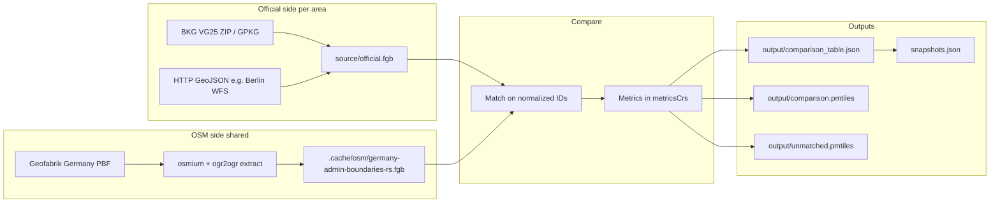

# Processing and analysis (how the pipeline works)

This document describes how the **OSM boundary checker (Germany)** ingests official and OSM boundaries, matches them, computes metrics, and what the published artifacts and UI numbers mean. Implementation entry points: `[scripts/compare/compare-boundaries.ts](../scripts/compare/compare-boundaries.ts)`, `[scripts/compare/lib/compare.ts](../scripts/compare/lib/compare.ts)`, `[scripts/compare/lib/metrics/calculateMetrics.ts](../scripts/compare/lib/metrics/calculateMetrics.ts)` (per-metric modules under `[scripts/compare/lib/metrics/](../scripts/compare/lib/metrics/)`).

---

## Runtime folder contract

- `**scripts/`\*\*: pipeline and compare implementation.
- `**datasets/`\*\*: area configs, official source files, and generated compare outputs.
- `**data/**`: pipeline processing status/log artifacts consumed by report status views.
- `**report/**`: frontend app and static snapshot/build tooling.
- `**.cache/**`: downloaded source and extraction caches.

`DATA_ROOT` is the runtime root that should contain `datasets/` and `data/`. Report snapshot/index generation and processing status are expected to read from the same `DATA_ROOT`.

---

## End-to-end flow

Nightlies and one-shot runs are orchestrated from the workspace root (see [README.md](../README.md)): `download` (BKG + optional HTTP official + OSM PBF/extract) then `compare` per `datasets/<area>/config.jsonc`. Official boundaries use **upstream metadata first**: each run resolves a canonical **`official.sourceUpdatedAt`** via `official.download.upstreamDateResolver` (BKG: GDZ HTML _Aktualitätsstand_; HTTP areas: e.g. `wfs_inspire_iso19139`, `iso19139_xml`, `ogc_api_features_temporal_end` — see [`scripts/shared/downloadOfficialConfig.ts`](../scripts/shared/downloadOfficialConfig.ts)). Geometry bytes (ZIP / GetFeature) are **skipped when `sourceUpdatedAt` is unchanged** and a prior FlatGeobuf exists, unless `--force`. OSM PBF caching keeps its own policy in [`scripts/osm/download-germany-pbf.ts`](../scripts/osm/download-germany-pbf.ts).

Config ownership is explicit:

- `datasets/<area>/config.jsonc` = human-authored setup (compare, profiles, optional direct official download/source facts).
- `datasets/<area>/source/metadata.json` = runtime provenance written by pipeline scripts. The `official` block holds the amtliche Quelle (URLs, licence, timestamps below). The `osm` block is **slim**: `downloadedAt` (PBF snapshot from header when applicable), optional `extractedAt` (when `osm:extract` rebuilt the shared FlatGeobuf), and optional `sourceDateSource`. Geofabrik URLs and ODbL defaults are **not** duplicated here — they live in `GERMANY_OSM_SOURCE_DEFAULTS` in [`scripts/shared/germanyOsmPbf.ts`](../scripts/shared/germanyOsmPbf.ts) and are merged at compare / report time via [`scripts/shared/osmGermanyProvenance.ts`](../scripts/shared/osmGermanyProvenance.ts).
- Legacy config keys `sources` and `osmExtract` are not supported.

### Source timestamp contract (`*At` fields)

Single reference for pipeline authors and report UI (avoid duplicating this elsewhere):

| Field                                       | Where written                            | Meaning                                                                                                                                            |
| ------------------------------------------- | ---------------------------------------- | -------------------------------------------------------------------------------------------------------------------------------------------------- |
| **`official.sourceUpdatedAt`**              | `bkg/extract.ts`, `download/official.ts` | **Amtlicher Datenstand** normalized to ISO (calendar reference from GDZ / capabilities / OGC API).                                                 |
| **`official.sourceUpdatedAtVerifiedAt`**    | Same                                     | Wall-clock instant when upstream metadata was **successfully re-fetched** and `sourceUpdatedAt` confirmed (even if geometry download was skipped). |
| **`official.downloadedAt`**                 | Same                                     | When **geometry bytes** were last fetched (ZIP / WFS response → FlatGeobuf), not the catalog check.                                                |
| **`official.sourceDateSource`**             | Same                                     | Provenance enum: `bkg_gdz_aktualitaetsstand`, `wfs_capabilities`, `ogc_api_features_collection`, … (canonical values only).                        |
| **`osm.downloadedAt`**                      | `osm/extract-osm.ts`                     | Snapshot time from **Germany PBF header** when `sourceDateSource === osm_pbf_header`.                                                              |
| **`osm.extractedAt`**                       | `osm/extract-osm.ts`                     | When the **shared OSM FlatGeobuf** was rebuilt (wall clock).                                                                                       |
| **BKG `.cache/bkg/download-metadata.json`** | `bkg/download.ts`                        | Same trio as official for VG25: `sourceUpdatedAt`, `sourceUpdatedAtVerifiedAt`, `downloadedAt` (+ paths).                                          |

Canonical-only runtime rule: `bkgDownloadMetadataSchema` does not accept legacy `zipLastFetchedAt`. If an **old** `.cache/bkg/download-metadata.json` is restored (for example from GitHub Actions cache), normalize it with `bun run migrate:source-metadata` before BKG extract runs.

CI enforcement: `data-refresh.yml` runs `migrate:source-metadata` after fallback artifacts are restored and before extract consumes BKG cache metadata. Checked-in `datasets/**/source/metadata.json` is validated by schema at read time; it is not rewritten by this migration.

Report KPI “Amtliche Daten” turns **rose** when **`sourceUpdatedAtVerifiedAt`** is older than ~14 days (`OFFICIAL_VERIFICATION_STALE_DAYS` in [`report/src/lib/officialAreaSummaryFreshness.ts`](../report/src/lib/officialAreaSummaryFreshness.ts)), not when `sourceUpdatedAt` is a past calendar year.

Embedded **`comparison_table.json`** carries the official/OSM metadata snapshot produced at compare time ([`scripts/compare/lib/writeOutputs.ts`](../scripts/compare/lib/writeOutputs.ts)); the UI reads **only** that payload — no runtime merge from `source/metadata.json`.

---

## How we compare the data

1. **Inputs**

- **Official:** one FlatGeobuf per area at `datasets/<area>/source/official.fgb`.
- **OSM:** a shared FlatGeobuf selected by top-level `osmProfile` (`admin_rs` or `postal_code`), built from the Germany extract.

2. **Matching key**

- OSM side uses `osmProfile`-derived `matchProperty` (`de:regionalschluessel` for `admin_rs`, `postal_code` for `postal_code`).
- Optional `**osm.matchCriteria**` supports identity matching (for example `relation_id` for Germany relation `51477` in `de-staat`) when tag-based joins are not reliable.
- Official side uses `**compare.officialMatchProperty**` in that area’s `config.jsonc` (e.g. BKG ARS column, Berlin Bezirke `name`, Berlin Ortsteile `sch`).
- Optional `**official.constantMatchKey**` can pin a dataset to one stable join key regardless of source column quirks (used by `de-staat`).
- Optional `**official.keyTransposition**`: when the official dataset has no compatible Schlüssel, map values from `**compare.officialMatchProperty**` to raw OSM Schlüssel strings, then normalize (`[scripts/compare/lib/officialKeyTransposition.ts](../scripts/compare/lib/officialKeyTransposition.ts)`).
- Values are normalized with a **preset** (`berlin-bezirk-ags`, `amtlicher-8`, `regional-12`, `plz-5`) in `[scripts/compare/lib/normalizeGermanKey.ts](../scripts/compare/lib/normalizeGermanKey.ts)` so key formats align where intended.

2b. **Explicit spatial scope (per dataset)**  
 Compare reads explicit enum decisions from `compare`:

- `compare.bboxFilter`: `none` or `official_bbox_overlap`
- `compare.osmScopeFilter`: `none` or `centroid_in_official_coverage`
- `compare.bboxBufferDegrees`: required when `bboxFilter=official_bbox_overlap`

With `bboxFilter=official_bbox_overlap`, compare derives a union bbox from official geometries, expands it by `compare.bboxBufferDegrees`, and drops OSM features whose bbox does not overlap. With `osmScopeFilter=centroid_in_official_coverage`, compare additionally keeps only OSM features whose centroid lies inside official polygon coverage before merge/metrics (`[scripts/compare/lib/compare.ts](../scripts/compare/lib/compare.ts)`).

1. **Geometry merge**
   Multiple official or OSM features sharing the same normalized key are **unioned** before metrics (`[scripts/compare/lib/geoMerge.ts](../scripts/compare/lib/geoMerge.ts)`).
2. **Row set**

- One **main table row per official key** (after union): `matched` if OSM has the same key, else `official_only`.
- **Unmatched OSM:** keys present in OSM but not in that area’s official export → `unmatchedOsm` in `comparison_table.json` and optional `unmatched.pmtiles`.

3. **Metrics CRS**
   Geometries are reprojected to each area’s `**metricsCrs`\*\* (e.g. `EPSG:25832` for most BKG areas, `EPSG:32633` for Berlin Bezirke) before intersection, union, areas, and Hausdorff (`[scripts/compare/lib/projectGeometry.ts](../scripts/compare/lib/projectGeometry.ts)`).

---

## BKG data (national administrative layers)

- **Product:** BKG **VG25** (Verwaltungsgebiete 1:25 000), distributed as a GeoPackage inside a ZIP.
- **Commands:** `bun run bkg:download`, `bun run bkg:extract` (or combined `bun run bkg`).
- **Details:** URLs, layer names (`vg25_gem`, `vg25_krs`, …), and `matchProperty` / preset hints: [vg25-bkg.md](./vg25-bkg.md).
- **Per-area configs:** under `datasets/de-*/config.jsonc` — each uses `officialProfile` (for example `bkg_vg25_gem`) + `compare.officialMatchProperty` + `idNormalization.preset` + `metricsCrs`.
- **BKG layer mapping:** resolved from shared `officialProfile` definitions (no per-area layer duplication).

---

## Berlin data (Bezirke example)

- **Official:** Berlin ALKIS Bezirke via WFS GeoJSON, fetched by `download:official` into `datasets/berlin-bezirke/source/official.fgb` (see `[datasets/berlin-bezirke/config.jsonc](../datasets/berlin-bezirke/config.jsonc)` and `[datasets/berlin-bezirke/README.md](../datasets/berlin-bezirke/README.md)`).
- **Matching:** `compare.officialMatchProperty` is `name` with preset `**berlin-bezirk-ags`\*\* so Berlin district names align with `de:regionalschluessel` on OSM.
- **Metrics CRS:** `EPSG:32633` (UTM zone 33N), chosen for that dataset.
- **OSM input:** still the **shared** Germany admin-boundaries FlatGeobuf — there is no separate per-area OSM file in the compare step.
- **OSM provenance defaults:** Geofabrik provider/licence metadata is centralized in `scripts/shared/germanyOsmPbf.ts`.

---

## Results: artifacts and what they tell us

| Artifact                             | Role                                                                                                                                                                       |
| ------------------------------------ | -------------------------------------------------------------------------------------------------------------------------------------------------------------------------- |
| `**output/comparison_table.json`\*\* | Machine-readable report: rows (official-first), per-row metrics when matched, bboxes, optional `officialForEditPath`, `sourceMetadata`, `unmatchedOsm`, flags for PMTiles. |
| `**output/comparison.pmtiles`\*\*    | Map tiles: official / OSM / diff layers for exploration and per-feature drill-down.                                                                                        |
| `**output/unmatched.pmtiles**`       | Tiles for OSM polygons with no official counterpart in **this** area’s export (tagging or coverage gaps).                                                                  |
| `**snapshots.json`\*\*               | Index of runs with **summary** fields for charts (see below).                                                                                                              |

**Interpretation:**

- **Matched + metrics** — Same normalized ID on both sides; IoU, area delta, symmetric difference, and Hausdorff describe **geometric** agreement. Low IoU or high Hausdorff → inspect map and tagging.
- `**official_only`\*\* — Official unit has no OSM polygon with that key in the selected OSM extract (missing/wrong OSM key, missing identity target, mergers, etc.).
- `**unmatchedOsm`\*\* — OSM has a boundary with a regional key that does not appear in this area’s official layer (extra mapping, wrong area file, or key normalization edge cases).

Operational notes and example counts: [comparison-status.md](./comparison-status.md).

---

## Analysis KPIs by UI level

Implementations and German modal copy are indexed in **[docs/kpis.md](./kpis.md)** (table of `compute.ts` + `de.ts` per metric). Published copy: [github.com/osmberlin/osm-boundary-checker-germany/blob/main/docs/kpis.md](https://github.com/osmberlin/osm-boundary-checker-germany/blob/main/docs/kpis.md).

| Level                          | KPIs / indicators                                                                                                              | Where it is defined                         |
| ------------------------------ | ------------------------------------------------------------------------------------------------------------------------------ | ------------------------------------------- |
| **Home (per area card)**       | Count **matched**, **official_only**, **unmatched OSM** (no geometry metrics)                                                  | [How we compare](#how-we-compare-the-data). |
| **Area report — summary row**  | Freshness: report generated time, official download time, OSM extract time                                                     | Provenance; not geometric KPIs.             |
| **Area report — category row** | Same three **counts** as home, with toggles for map/table                                                                      | [How we compare](#how-we-compare-the-data). |
| **Area report — chart**        | **Mean IoU** per snapshot (`snapshots.json` → `summary.meanIou`); optional issue/review summary counters                       | [kpis.md](./kpis.md) → Mean IoU row         |
| **Area report — table**        | Per row: **IoU**, **Δ area %**, **Hausdorff (m)**, **Hausdorff P95**, **issue indicator**                                      | [kpis.md](./kpis.md)                        |
| **Feature detail**             | **IoU**, **area delta**, **symmetric difference %**, **Hausdorff**, **Hausdorff P95**, **issue indicator**; area layer toggles | [kpis.md](./kpis.md)                        |

**In-app modals:** `[report/src/components/MetricInfoModal.tsx](../report/src/components/MetricInfoModal.tsx)` imports copy from `[scripts/compare/lib/metrics/modalCopyDe.ts](../scripts/compare/lib/metrics/modalCopyDe.ts)` (re-exports each metric’s `de.ts`).

---

## Related docs

- [README.md](../README.md) — commands, deploy, data layout
- [vg25-bkg.md](./vg25-bkg.md) — BKG download and layers
- [comparison-status.md](./comparison-status.md) — recent run notes and data gaps
- [kpis.md](./kpis.md) — KPI index (links to `compute.ts` / `de.ts` per metric)
- [nightly-runtime-rate-limits.md](./nightly-runtime-rate-limits.md) — GitHub/runtime limits and no-cost optimization guide
